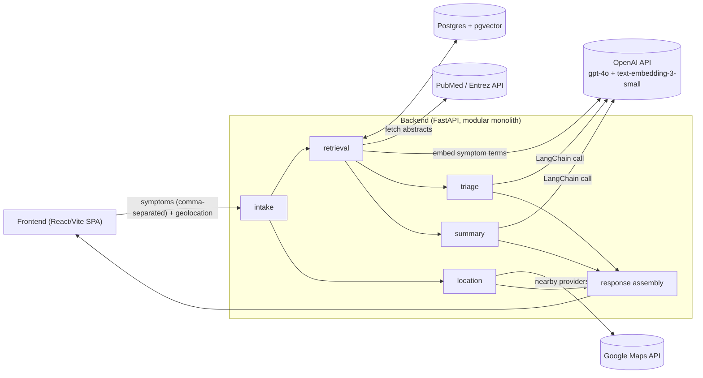
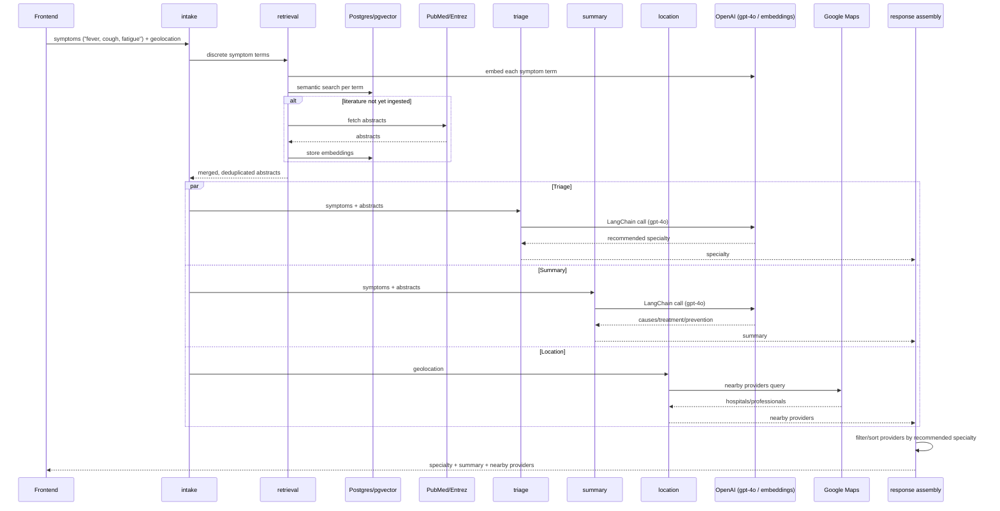

# Architecture

## Style: Modular Monolith, Monorepo

The backend is a single deployable FastAPI service, internally split into clearly bounded modules — not a microservices architecture. This keeps the MVP simple to build, test, and deploy while no auth or heavy scale is required yet. Frontend and backend live in the same repository (monorepo) rather than split across repos.

Planned top-level layout:

```
medisync/
├── backend/                # FastAPI modular monolith
│   └── app/
│       ├── intake/         # receives symptoms + optional location
│       ├── retrieval/      # PubMed fetch, embedding, pgvector semantic search (RAG)
│       ├── triage/         # LLM-based specialty recommendation + doctor matching
│       ├── summary/        # causes/treatment/prevention summarization
│       ├── location/       # Google Maps: geolocation + nearby provider lookup
│       └── main.py
├── frontend/                # React (Vite) SPA
├── docs/                    # PRD, glossary, architecture, tech stack, features, strategies
└── CLAUDE.md
```

## Component diagram



`triage`, `summary`, and `location` all branch off `intake`/`retrieval` and run independently — `response assembly` is where their outputs (and the specialty-based filtering of location results) come back together before the frontend renders anything.

## Request flow

1. **Intake** — user submits symptoms as a comma-separated list (e.g. `fever, cough, fatigue`) via the frontend; the `intake` module parses this into discrete symptom terms. Browser geolocation is captured automatically (FR-05) and sent alongside.
2. **Retrieval (RAG)** — the `retrieval` module embeds each discrete symptom term (`text-embedding-3-small`) and runs semantic search against PubMed abstracts stored in `pgvector` (FR-08), merging/deduplicating results across symptoms. If relevant literature isn't already ingested, it's fetched live from the PubMed/Entrez API (FR-06).
3. **Triage + Summary** — retrieved abstracts + symptoms are passed through a LangChain pipeline to `gpt-4o`, producing (a) a recommended medical specialty (FR-02, FR-07) and (b) a summary of possible causes, treatments, and preventive measures (FR-04).
4. **Location** — in parallel with step 3, the `location` module queries the Google Maps API for nearby hospitals/professionals near the user's location (FR-03).
5. **Response assembly** — the backend combines the triage result and summary with the location results, filtering/sorting the latter by the specialty recommended in step 3, into a single response for the frontend to render.

Steps 3 and 4 are run concurrently (not sequentially) since both depend only on the intake data, not on each other's output — this is the main lever for meeting the 5-second response budget (NFR-02). Specialty-based filtering of location results happens afterward, at assembly time, so it doesn't force step 4 to wait on step 3.



## Why no auth in this architecture

Per the PRD's assumptions, v1 ships without an authentication service and without safeguards against anonymous usage. Requests are stateless — there is no user/session module in the MVP. Don't add one preemptively.
